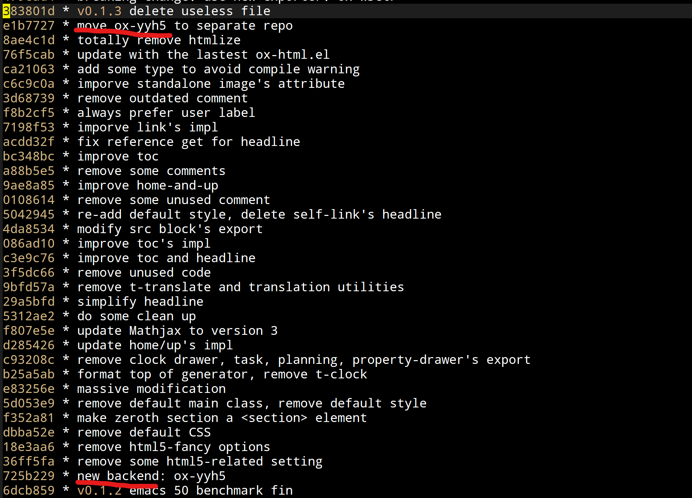
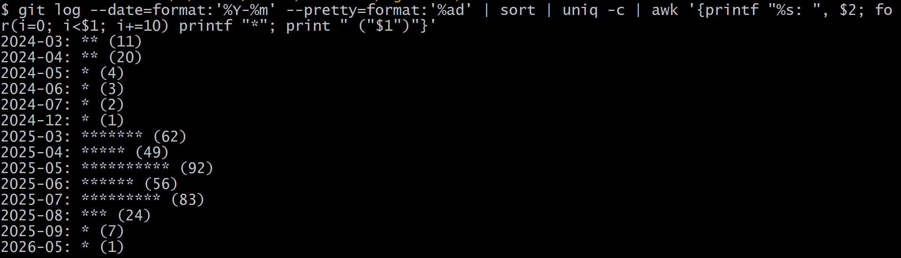

#+TITLE: ox-w3ctr 开发笔记 (5.5)
#+DATE: [2026-05-31 Sun 03:50]--[2026-05-31 Sun 18:27]
#+FILETAGS: orgmode
#+DESCRIPTION: 太久没写博客了。本文总结了过去开发 ox-w3ctr 的进度，并简单规划了接下来的开发计划，如果这也算开发的话。

# [[https://www.pixiv.net/artworks/144300882][file:dev/p0.jpg]]

转眼间 26 年马上就要正式过去一半了，在我敲下这段文本的下一天就是六月了。从狗屎工作和狂热投机中挣脱出来后一看，今年竟然只写了两篇博客。好在目前虽见「向之所欣，俯仰之间已为陈迹」，但心里「犹不能不以之兴怀」，还有什么想写的就继续写吧。

本文是对过去 ox-w3ctr 开发记录的总结，以及对接下来的开发过程的计划。考虑到我写这一系列博客最初纯粹是为了记录开发过程，这里补一下由来和目标也是很有必要的。好在有 git 提交记录和去年写的开发笔记，至少我不会完全找不到开发细节和目标。

* 什么是 ox-w3ctr

简单来说，[[https://github.com/include-yy/ox-w3ctr][ox-w3ctr]] 是一个 Org-mode 的导出后端，可以通过 Emacs 将 Org-mode 文本文件导出到 HTML 文件，方便后续内容的浏览和发布。用过 ox-html.el 的同学应该很容易弄明白这是个什么工具，实际上 ox-w3ctr 就是在 ox-html 的基础上做了我认为需要的一些修改。

从 ox-w3ctr.el 的文件头注释来看，我将它作为单独的项目创建的时间应该是 2024 年 3 月 18 日。从 git 提交历史来看，ox-w3ctr 应该是我在博客项目中尝试创建一个改良的导出后端时意识到需要将这一代码与博客本身分离而诞生的产物。

#+caption: [2024-03-18]--[2024-03-29]

翻看 git 提交历史我总能感觉有个详细记录下博客历史的必要，也许有时间能写一写。

* 已经完成的工作

从提交历史来看，ox-w3ctr 的开发高峰集中于 25 年的 3 月到 8 月，这大概也是我近两年来最闲的时候，平均下来一个月差不多有 60 次提交，然后我就陷入狗屎般的工作了，笑死。

在 25 年 5 月我完成了开发笔记系列的[[https://egh0bww1.com/posts/2025-05-09-58-ox-w3ctr-notes-1][第一篇]]，添加了新的属性语法来替代 =#+attr_html: :class data= 为 HTML 元素添加属性。考虑到我的博客仅导出到 HTML，我使用 =#+attr__= 替代了 =#+attr_html=​，使用 S-表达式替代了类似 plist 的语法，同时为 class 属性添加了方便的类向量语法，最终可以写成 =#+attr__: [data]=​。

从[[https://egh0bww1.com/posts/2025-05-15-59-ox-w3ctr-notes-2/][第二篇]]来看，此时我已经完成了大部分 element 和 object 的代码改进，不过剩下的全是硬骨头。在[[https://egh0bww1.com/posts/2025-06-23-61-ox-w3ctr-notes-3/][第三篇]]我重点解决了时间戳的导出问题，还添加了时区相关的代码，不过基本上可能没多少情况能够用上。在[[https://egh0bww1.com/posts/2025-07-23-62-ox-w3ctr-notes-4][第四篇]]主要改进了 Headline 和 Section 的生成，[[https://egh0bww1.com/posts/2025-08-06-63-ox-w3ctr-notes-5/][第五篇]]主要解决的是 template 和 inner-template 的生成问题。

那么，截止目前还剩下的规划内容应该是：

#+attr__: [index]
- special-block
- table, table-row, table-cell
- latex-environment, latex-fragment
- src-block, inline-src-block
- footnote-reference
- link

* 未来的计划

理论上来说，把这些问题解决掉整个开发过程就结束了，但这几个都不是什么好啃的骨头。

除了功能上的问题，代码本身的质量也需要关心，这方面主要在 docstring 和代码测试上做了一些了解：[[https://egh0bww1.com/posts/2025-09-01-64-write-elisp-docstring/][如何编写 Emacs Lisp 文档字符串]]，[[https://egh0bww1.com/posts/2025-11-07-66-write-elisp-tests/][如何测试程序 — 改变认识与人工代码检查]]。当前我的测试思路是为所有的函数编写测试代码，但这会严重拖累开发而且完全没必要。

** special-block

在最初的 ox-w3ctr 中，我使用了 dynamic block 来作为各种 H5 标签的载体，比如 =#+begin: aside=​，但是 dynamic block 本身用于动态生成块中内容，special block 的工作还是回到 special block 算了。

当前，ox-html 对 special block 的利用非常简单，就是属于 HTML 标签的块导出到对应的 HTML，比如 =#+begin_aside= 和 =#+begin_video=​，但这一利用方法还远远没有发挥出 special block 的潜力。这一点上可以参考 [[https://github.com/alhassy/org-special-block-extras][org-special-block-extras]] 和 [[https://github.com/QiangF/org-extra-emphasis][org-extra-emphasis]]。

** table

ox-html 在 table 的导出上代码量并不小，我的改进工作量对应的应该也不会小，但目前姑且还是在用 ox-html 的代码。Org-mode 本身支持两种形式的表格，我也需要考虑是否去掉另一种。

ox-html 不支持表格中添加块级元素，也许我应该考虑实现这一功能，比如通过表格来实现代码块的并排。（当然现代可以使用现代 CSS 的 flex 或 grid 布局）。

** latex

latex 那更是一大坨。Org-mode 本身支持 MathJax 网页端渲染数学公式，或者通过本地 latex 命令生成 svg 图片。除 MathJax 外我们也能使用 MathML 来利用浏览器直接渲染，由 latex 到 MathML 的生成有多种工具，目前我还不清楚到底要选哪一种，MathJax 本身也能生成 MathML，最后应该会选它。

在 2025 年 8 月 5 日，MathJax 发布了[[https://github.com/mathjax/MathJax/releases/tag/4.0.0][v4.0.0]] 版本，Org-mode 目前还在使用 V3 版本，后续的 ox-w3ctr 会升级到 V4。V4 相比 V3 解决了一大堆问题。

** src-block

在 ow-w3ctr 中我已经使用 [[https://github.com/tecosaur/engrave-faces][engrave-face]] 替换掉了比较老的 [[https://github.com/emacsorphanage/htmlize][htmlize]]。目前代码的渲染主要由 Emacs 的 major-mode 来完成，之后也许可以考虑添加一些前端渲染方案，或者为后端渲染添加更多选项，比如 highlight.js。

ox-html 在代码高亮这一块的代码我也感觉是一坨，已经清理不少了，也许还需要一些工作。

** footnote 和 link

footnote 部分，当多个正文使用相同脚注时，脚注位置的返回按钮没法对应到多个可能的位置，这部分代码需要改进。

至于 link，代码还是只能用一坨来形容，需要拆分成更加清晰的小函数。

* 后记

如果没什么问题的话上面的这些目标我会一个一个推进，在完成所有功能后精细化代码以及文档，然后发布文档和正式的 ELPA 包。从一个成熟项目的角度来说现在还差得远。

在刚开始写 ox-w3ctr 的代码时，我是把它当作「我的最后一个大型 Elisp 项目」来写的，但最后能不能完成只能说尽力，AI 开发技术的发展感觉已经快淘汰掉传统的开发流程（也许可以叫古法编程）了，这不由得让我怀疑我花在这个项目上的时间是否值得。

虽然整个五月老登股票走出了 ST 的样子，希望他们有重新涨起来的那天，同样的希望献给 Emacs。

# | [[https://www.pixiv.net/artworks/88826821][file:dev/p1.jpg]] | [[https://www.pixiv.net/artworks/145235158][file:dev/p2.jpg]] |

